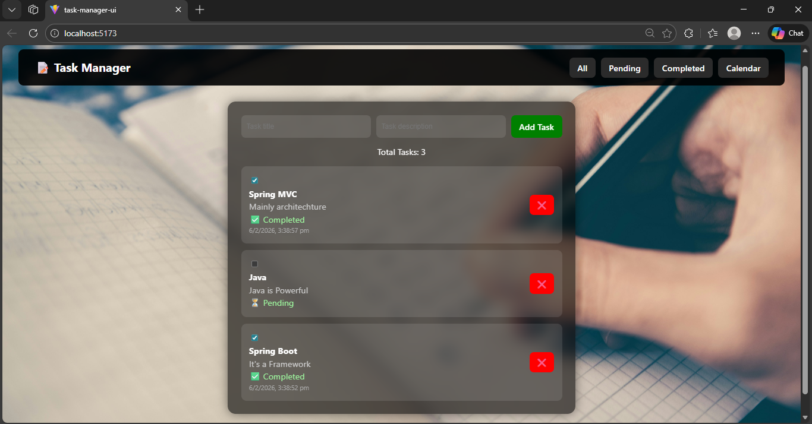

# 📝 Task Manager – Full Stack Application

A modern **Full Stack Task Manager** built using **React, Spring Boot, and MySQL**.  
This application allows users to efficiently manage their daily tasks with features like adding, deleting, marking complete, filtering, and calendar integration.

---

## 🚀 Live Features

✅ Add new tasks with description  
✅ Mark tasks as Completed / Pending  
✅ Automatic completion date & time tracking  
✅ Filter tasks (All / Pending / Completed)  
✅ Calendar dropdown view  
✅ Delete tasks  
✅ Responsive modern UI  
✅ REST API based backend  
✅ MySQL database integration  

---

## 🖥️ Application Preview

### Main Dashboard



---

## 🏗️ Tech Stack

### Frontend
- React (Vite)
- JavaScript
- CSS
- Axios
- React Calendar

### Backend
- Spring Boot
- Java
- Spring Data JPA
- REST APIs

### Database
- MySQL

---

## 📂 Project Structure

```
Task-Management
│
├── taskmanager-ui       # React Frontend
│
├── taskmanager          # Spring Boot Backend
│
└── README.md
```

---

## ⚙️ Backend Setup (Spring Boot)

### 1. Navigate to backend
```bash
cd taskmanager
```

### 2. Configure MySQL in application.properties

```properties
spring.datasource.url=jdbc:mysql://localhost:3306/task_manager_db
spring.datasource.username=root
spring.datasource.password=your_password

spring.jpa.hibernate.ddl-auto=update
```

### 3. Run the backend

```bash
./mvnw spring-boot:run
```

Backend runs on:

```
http://localhost:8080
```

---

## ⚙️ Frontend Setup (React)

### 1. Navigate to frontend

```bash
cd taskmanager-ui
```

### 2. Install dependencies

```bash
npm install
```

### 3. Run frontend

```bash
npm run dev
```

Frontend runs on:

```
http://localhost:5173
```

---

## 🔌 API Endpoints

| Method | Endpoint | Description |
|------|----------|-------------|
| GET | /api/tasks | Get all tasks |
| POST | /api/tasks | Create new task |
| PUT | /api/tasks/{id} | Update task |
| DELETE | /api/tasks/{id} | Delete task |

---

## 🧠 Learning Highlights

This project demonstrates:

- Full Stack Development
- REST API Design
- Spring Boot Architecture
- React State Management
- Database Integration
- Clean UI Design
- Real-world project structure

---

## 👨‍💻 Author

**Ansona Peter**

GitHub:  
https://github.com/ansonapeter

---

## ⭐ Future Improvements

- User Authentication (JWT)
- Edit task feature
- Drag & Drop tasks
- Deploy to cloud (AWS / Render)

---

## 📜 License

This project is open source and free to use.

---

